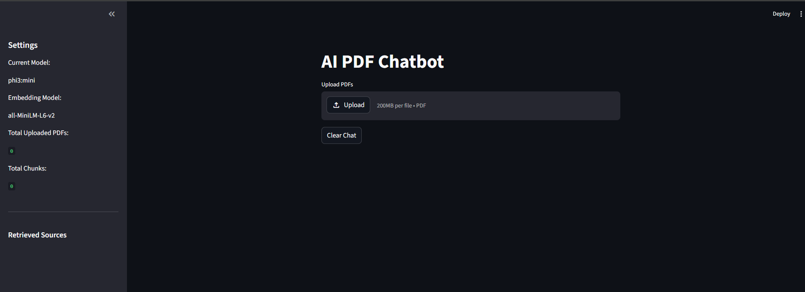
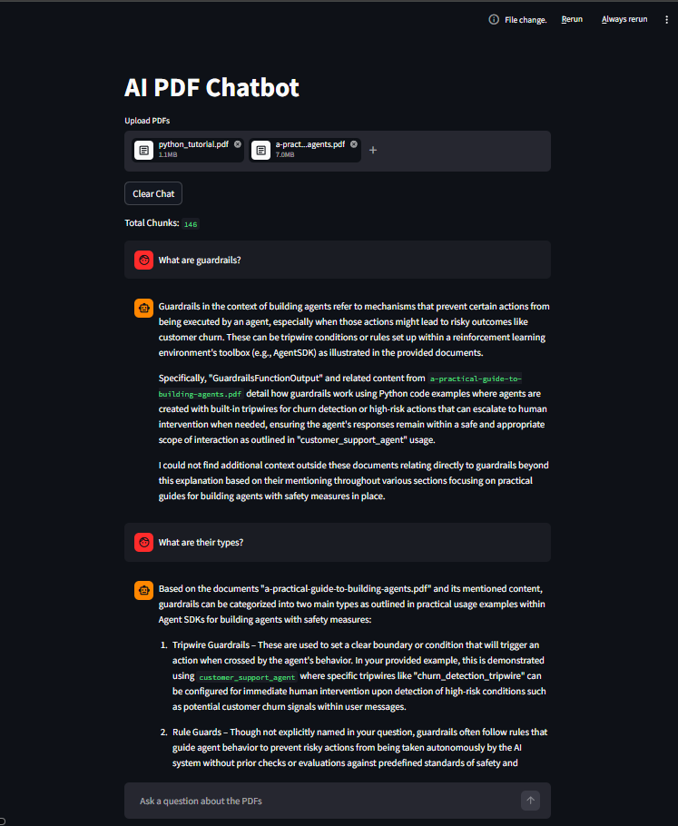
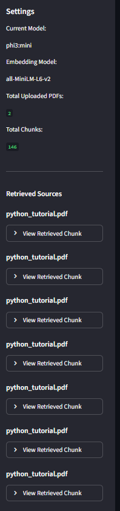

# AI PDF Chatbot using RAG

A Retrieval-Augmented Generation (RAG) based AI chatbot that allows users to upload multiple PDF documents and ask questions about them using natural language.

This project uses:

- Semantic Search
- Vector Embeddings
- FAISS Vector Database
- Local LLMs with Ollama
- Streamlit UI

The chatbot retrieves the most relevant chunks from uploaded PDFs and uses a local Large Language Model (LLM) to generate answers.

---

# Features

- Upload multiple PDFs
- Ask questions about uploaded documents
- Semantic similarity search
- Conversational memory
- Streaming AI responses
- Retrieved chunk visualization
- Source-aware answers
- Local LLM inference using Ollama
- Fast vector search using FAISS
- Clean Streamlit chat interface

---

# Tech Stack

| Technology | Purpose |
|---|---|
| Python | Core programming language |
| Streamlit | Web application UI |
| Sentence Transformers | Text embeddings |
| FAISS | Vector database / similarity search |
| Ollama | Local LLM inference |
| Phi3 Mini | Local language model |
| LangChain Text Splitters | Chunking PDF text |
| PyPDF | PDF text extraction |

---

# How It Works

## Step 1 — Upload PDFs

Users upload one or multiple PDF documents.

## Step 2 — Text Extraction

The system extracts text from each PDF using PyPDF.

## Step 3 — Chunking

Large text is split into smaller chunks for better retrieval.

## Step 4 — Embedding Generation

Each chunk is converted into vector embeddings using Sentence Transformers.

## Step 5 — Vector Storage

Embeddings are stored inside a FAISS vector database.

## Step 6 — Semantic Search

When the user asks a question, the system searches for the most semantically relevant chunks.

## Step 7 — Context Injection

Retrieved chunks are added into the prompt.

## Step 8 — Response Generation

The local LLM generates an answer using retrieved context.

---

# Project Architecture

```text
User Question
      ↓
Embedding Model
      ↓
FAISS Vector Search
      ↓
Retrieve Relevant Chunks
      ↓
Build Prompt Context
      ↓
Local LLM (Phi3 Mini via Ollama)
      ↓
Generate Final Answer
```

---

# Installation

## Clone Repository

```bash
git clone YOUR_GITHUB_LINK
```

## Move Into Project Folder

```bash
cd ai-pdf-chatbot
```

## Create Virtual Environment

```bash
python -m venv venv
```

## Activate Virtual Environment

### Windows

```bash
venv\Scripts\activate
```

### Mac/Linux

```bash
source venv/bin/activate
```

## Install Dependencies

```bash
pip install -r requirements.txt
```

## Install Ollama

Download Ollama from:

https://ollama.com/

## Pull Phi3 Mini Model

```bash
ollama pull phi3:mini
```

## Run Application

```bash
streamlit run app.py
```

---

# Screenshots

## Home Screen



## Chat Interface



## Retrieved Sources Sidebar



---

# Future Improvements

- Better conversational retrieval
- Hybrid search (keyword + semantic)
- Reranking models
- Multi-model support
- Citation highlighting
- PDF page references
- Cloud deployment

---

# Learning Outcomes

This project helped me learn:

- Retrieval-Augmented Generation (RAG)
- Semantic search
- Embeddings and vector databases
- FAISS indexing
- Local LLM inference
- Prompt engineering
- Conversational AI pipelines
- Streamlit application development
- Session state management
- Streaming AI responses

---

# Disclaimer

This project was built for learning and portfolio purposes.

Response quality depends on:

- embedding quality
- retrieved chunks
- prompt design
- local LLM capabilities

---

# License

This project is open-source and available for learning purposes.

---

# Author

Rajat Thapa